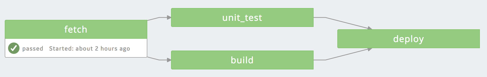

# PredixCI-HelloWorld-Pipeline 

This is a sample PredixCI Pipeline that deploys a Cloudfoundry Application, this sample can be modified by changing the contents of the scripts listed in [predix-ci.yml](./predix-ci.yml)

## Fetch
Pull the source code from Github

## Unit Test
Run Unit Tests to verify that the code changes are correct

## Build
Run a build script that modifies the index.html that we're deploying

## Deploy
Authenticate w/ Cloudfoundry using Predix.io UAA and deploy the application to our Cloudfoundry org/space
